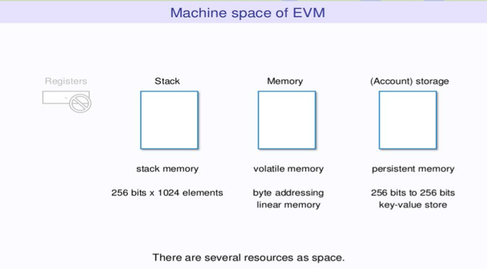

# Lesson 1: Types of Memory in Solidity

## Introduction

Ethereum has mainly three types of memory:

- **Stack/Calldata:** This is a special data location that contains function arguments.
- **Memory:** Variables that are declared in functions are stored in memory and their lifespan lasts until the function executes.
- **(Account) Storage:** State variables are stored in storage which implies that they are stored on the blockchain.

<br>

## About Memory

Let's look at each memory type in detail:

**Storage:**

- Storage is a location that stores state variables that exists permanently in the contract. Storage is like database data stored in a blockchain node file system. It is persistent and has access to multiple executions of the same contract.
- Storage is a key-value store that maps 256-bit words to 256-bit words. Storage data is costly(consuming much gas) because it is written in blockchain(like HDD/SDD). Therefore,
- It should be used when it is indispensable such as a money balance.
- Data in storage is written in the blockchain hence they change the state available between calls and transactions that’s why are expensive.

**Memory:**

- Memory is a byte-array data that exists only during the function call. Every message call starts with a cleared memory.
- Memory is volatile data and not recorded in the blockchain, so it is much cheaper than storage.
- Memory is like RAM used to store short-lived data that spans around function calls. Memory can be used for every non-permanent data.

**Stack:**

- The stack holds small local variables. It has a maximum size of 1024 elements and contains words of 256 bits.
- It means the maximum size of the stack is 1024 * 256 bits(262,144bits). If you run out of the stack, contract execution will fail.
- EVM provides many opcodes to change stack directly such as POP, PUSH, DUP(duplicate), and SWAP.
- A stack is an internal place where temporary variables are stored in 32 bits slots it is usually used for value types

Now, let us compare storage and memory:


**Storage**

- Stores data in between function calls
- The data previously placed in the storage area is accessible to each execution of the smart contract
- Consumes more gas
- Holds array, state, and local variables of the struct

**Memory**

- Stores data temporarily
- Memory is wiped completely once the code is executed
- Has less gas consumption, and is better for intermediate calculations
- Holds Functions argument


## Using Memory


Storage Example

```js
contract StorageC {
  struct LotteryNumber{
    uint256 Lnumber;
    string selection;
  }  mapping(address => LotteryNumber) LotteryNumber;
}
```

In this example, the smart contract’s state struct variable LotteryNumber is kept in storage, and data will persist between function calls.

Memory example

```js
function multiply(uint256 num) external pure returns(uint256) {
  uint256 result = num * num;  return result;
}
```

In the above example, the num variable is stored temporarily and locally in memory and it will be released as soon as the function call is completed