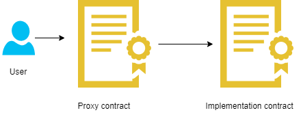

# Lesson 2: Proxy contracts Upgradeable contracts

## Introduction

One of the greatest features of the blockchain is that data is immutable.

**Challenges due to the immutability of blockchain**

- When you deploy your smart contract, you can’t change the code afterward and thus can’t upgrade the smart contract. Once the transaction is sent: it stays forever, there is nothing you can do to reverse the state previous state of the EVM. If you still want to update the smart contract, you need to deploy a new one in a new address, pay the gas fees, migrate all the data and convince current users to use the new V2 contract.
  
- This is a very cumbersome process, it takes a lot of time to do. Also, there is a high chance of making mistakes when migrating the data. All of which can lead to disastrous consequences for users.
We make smart contracts upgradeable by using proxy contracts

We make smart contracts upgradeable by using **proxy contracts**

## About Proxy/Upgradeable contracts

**Working of proxy contracts or upgradeable smart contracts**

There are two different smart contracts:

- The first one is called the implementation (or the logic) contract. It contains all the regular functions of the smart contract. (like `transfer()`, `approve()`, and so on…)
- And the second one is called the proxy contract. It contains an address in storage that points to the implementation contract address and a function that delegates call to the implementation contract and the storage of Dapps.

<br>

## Using Proxy/Upgradeable contracts

**DelegateCall Example for Upgradeable Smart contracts**

In the below example we have two contracts OneCall and Twocalled. OneCall is delegating control to Twocalled contract. OneCall’s address, storage memory location, and Ether balance will be used to execute the logic of Twocalled contract’s logic.

```js
// SPDX-License-Identifier: MIT
pragma solidity ^0.8.13;

// NOTE: Deploy this contract first
contract Twocalled {
    // NOTE: storage layout must be the same as contract oneCall
    uint public num;
    address public sender;
    uint public value;

    function setVars(uint _num) public payable {
        num = _num;
        sender = msg.sender;
        value = msg.value;
    }
}

contract OneCall {
    uint public num;
    address public sender;
    uint public value;

    function setVars(address _contract, uint _num) public payable {
        // OneCall's storage is set, Twocall is not modified.
        (bool success, bytes memory data) = _contract.delegatecall(
            abi.encodeWithSignature("setVars(uint256)", _num)
        );
    }
}
```