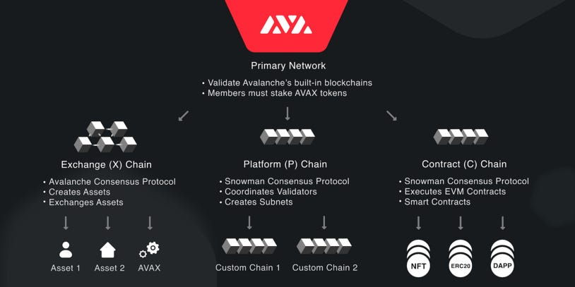

# Lesson 2:  Introduction to Avalanche

## Meet the Chains

Watch this video [Avalanche AVAX Explained | 2 Minute Crypto](https://youtu.be/WAbuT-yYnwQ) 

Avalanche has become increasingly popular due to the platform's unique features, and it's no wonder why! As the first decentralized smart contracts platform built for the scale of global finance ⚖️, Avalanche offers near-instant transaction finality, low fees, and high scalability. But wait, there's more! Avalanche is not just one chain, but multiple "chains" or subnets that work together seamlessly 🤯:

 

- **Exchange Chain**, or the **X-Chain**, is where all the action happens with digital smart assets known as Avalanche Native Tokens.

- **Contract Chain**, or the **C-Chain**, is an implementation of the Ethereum Virtual Machine (EVM) where you can flex your Solidity skills and create and execute smart contracts.

- **Platform Chain**, or the **P-Chain**, is where the magic happens 🧙‍♂️, supporting the creation of new blockchains and subnets, staking operations, and more.

And let's not forget about the real MVP - AVAX! This native token is the backbone of the Avalanche network, securing it, paying for fees, and serving as the base unit of account between all the different blockchains on the platform.

In this lesson, we’re going to show you how to set up a basic project using [Hardhat](https://hardhat.org/), connect it to the Avalanche C-Chain, deploy a WAVAX (ERC20) smart contract, interact with it on [Snowtrace](https://snowtrace.io/) (Avalanche's native block explorer), and even show you how to use custom scripts on Hardhat.

## Enter the Avalanche X-Chain

This powerful chain is responsible for the creation and trading of digital smart assets, known as Avalanche Native Tokens, which can represent anything from cryptocurrencies to stocks, bonds, and even real estate 🏡. With the user-friendly [X-Chain API](https://docs.avax.network/reference/avalanchego/x-chain/api), creating and trading these tokens has never been easier.

But the X-Chain isn't just easy to use - it's also lightning-fast ⚡ and incredibly affordable. With high throughput and low transaction fees, you can trade assets quickly and efficiently. And with the added benefit of atomic swaps, there's no need to rely on centralized exchanges or intermediaries to exchange one asset for another.

## Avalanche P-Chain: The Backbone of the Network

The P-Chain is like the backstage manager of the Avalanche platform, responsible for all the heavy lifting 🏋️ and behind-the-scenes work necessary to keep the network running smoothly. This chain is the ultimate multitasker, managing everything from creating and managing new blockchains and subnets to staking operations that secure the network and maintain consensus across all subnets on the Avalanche network.

By locking up AVAX tokens as collateral, users can become validators or delegate their tokens to an existing validator to participate in the consensus process. Validators are like the guardians of the network, verifying transactions and adding new blocks to the chain, and are rewarded with AVAX tokens for their hard work 💰

But that's not all the P-Chain can do. It also supports the creation of custom subnets, which are like separate playgrounds with their own unique set of rules and parameters. You can use them to experiment with different execution environments or create private networks for your specific needs.

Think of the P-Chain as the backbone of the Avalanche platform, providing the infrastructure and governance mechanisms necessary to maintain a secure and decentralized network 🌐🔒

The P-Chain is an instance of the Platform Virtual Machine. To get started with the P-Chain, you can use the [P-Chain API](https://docs.avax.network/reference/avalanchego/p-chain/api) which supports the creation of new blockchains and Subnets, the addition of validators to Subnets, staking operations, and other platform-level operations.

## Avalanche C-Chain: Decentralized Applications Made Easy

Welcome to the Avalanche C-Chain, the heart of decentralized application (dApp) development on Avalanche! As an implementation of the Ethereum Virtual Machine (EVM), the C-Chain supports the creation and execution of smart contracts written in Solidity. This makes it easy for developers familiar with Ethereum to build and deploy decentralized applications (dApps) on Avalanche - that’s you! 😉

With its high performance and low transaction fees, the C-Chain is the perfect platform for building high-volume dApps. It offers sub-second finality, and it’s low gas fees mean you won't break the bank when developing and deploying your applications 💸

The C-Chain also supports interoperability with other blockchains, including Ethereum, thanks to cross-chain bridges 🌉 This means that assets and data can be transferred between the two chains, opening up new possibilities for decentralized finance (DeFi) and other use cases.

To get started with the C-Chain, simply use the [C-Chain API](https://docs.avax.network/reference/avalanchego/x-chain/api) which provides a similar interface to the Ethereum JSON-RPC API, making it easy for developers to interact with the C-Chain using their existing tools and libraries.

## Snowtrace: An Introduction

Snowtrace is a powerful blockchain explorer designed for the Avalanche Network. If you're familiar with Etherscan or Polyscan, Snowtrace works just like those platforms, providing users with access to valuable information about addresses, transactions, blockhashes, and more that are all live on the Avalanche blockchain.

In the next lesson, you'll be using an API key from Snowtrace to verify a contract that has been deployed on the Avalanche testnet. To help you understand what Snowtrace can do for you, and how to get your own API key, we recommend taking a quick look 👀 at the [video](https://youtu.be/dX1EDrGFo2M) 

With Snowtrace and your API key, you can now easily access and analyze data on the Avalanche blockchain, which is essential for anyone looking to develop, deploy, or interact with smart contracts 😎

Now that you've learned the fundamentals of the Avalanche Network and Snowtrace, it's time to put your knowledge to work with a practical, hands-on demonstration. In our upcoming lesson, we'll dive 🤿 into the practical side of the C-Chain and show you how to create, deploy, and verify a smart contract on the Avalanche Network. Are you excited? Because we sure are! Let's go! 🔥