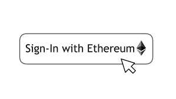
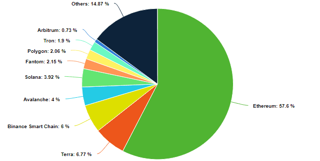
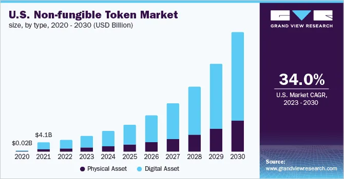
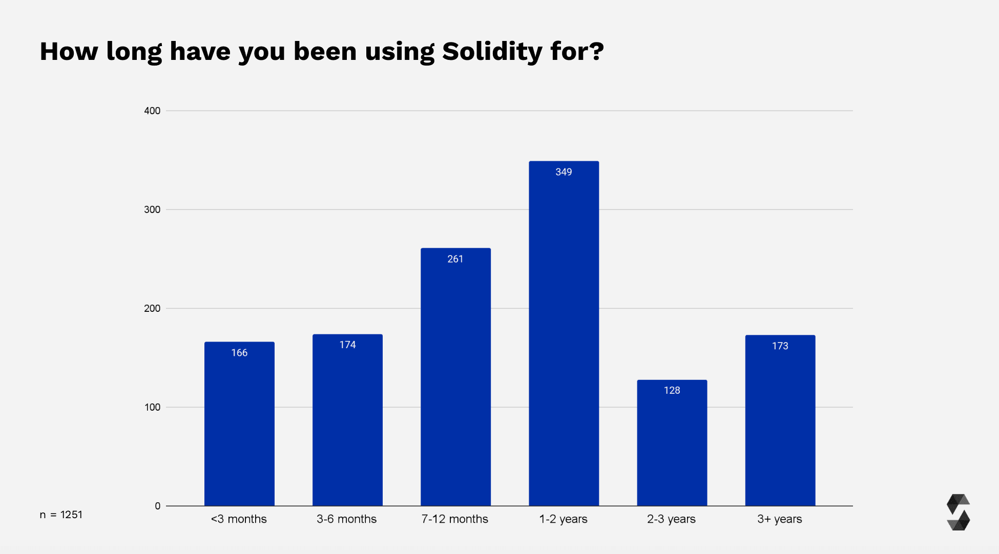
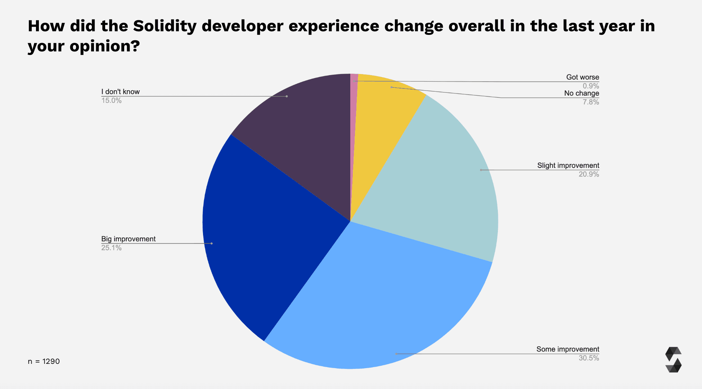
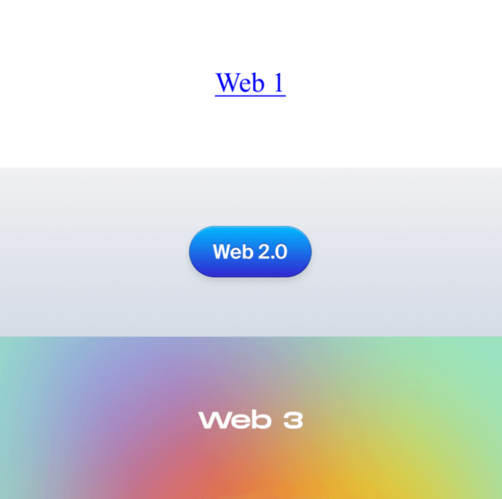

# Lesson 1: Web3

## Industry Demand
Young Crafter. You are entering the exciting world of Ethereum at the perfect moment. You can build smart contracts to launch new economies and create the infrastructure for the next generation of applications in the decentralized web.

### What Your New Powers Can Do
Ethereum is a foundation for creativity and innovation. It powers web3 efforts from major companies all the way to individuals. Here’s just a taste of some of the interesting ways Ethereum is used.

### Build the Future of Finance
Ethereum has created decentralized alternatives to most financial services as well as completely new financial instruments. Here is an ever-growing list from the Etheruem Foundation of what you can do with Ethereum:

[Send money around the globe](https://ethereum.org/en/defi/#send-money) 
[Stream money around the globe](https://ethereum.org/en/defi/#stream-money) 
[Exchange tokens](https://ethereum.org/en/defi/#swaps) 

This video gives a powerful overview of the future of finance powered by [Ethereum](https://youtu.be/H-O3r2YMWJ4).

### Create Entire Cities and New Forms of Work

Our companies and organizations are limited by trust. If we don’t have a contract or trust the people we want to work with, little gets done. DAOs solves this for decentralized work.

Individuals can come together to solve big problems and trust one another thanks to a smart contract, often built on Ethereum.

This smart contract is the backbone of a DAO. It defines the rules of the organization and holds the group's treasury. Once the contract is live on Ethereum, no one can change the rules except by a vote.

This is a huge opportunity because now people can come and contribute one idea or work full-time on a project and still get compensated and have a voice based on their contribution.

See how smart contracts could enable world building [here](https://youtu.be/zTStDvUtQWc)

### Inspire Customer Loyalty*

Companies like Starbucks use the Ethereum blockchain to store a customer’s loyalty information. This enables customers to own these perks and even trade them with other coffee drinkers.

 

### Guarantee Privacy and Ownership of Identity
We use our identity for almost everything we do, from education to paying taxes, getting a driver’s license to getting into a bar. This information is stored centrally by an institution, often a government or university.

Ethereum enables us to own our own identity and use a decentralized identifier. Our key details are stored in our wallets, and specific information can be shared when needed without revealing other parts of our identity.

Imagine not having to call the registrar for your diploma, logging into a website without giving your email, or proving you are old enough for a beer without giving your address and personal details. This is all possible with decentralized identity build on Ethereum.

 

### Always Connect With Your Social Network

Social media is inherently centralized with large social networks owning your data and using it for advertising as well as choosing what can and cannot be shared.

Decentralized social networks solve this problem. You can connect with your social network and own these connections. That means you can bring them to other networks, communicate directly with them without interference, and build an audience that moves with you instead of being held within a platform.

The future of decentralized social media is built on Ethereum. Check out this [video](https://youtu.be/UdT2lpcGvcQ) 

### Own Digital Assets with NFTs

NFTs represent ownership of any digital asset. While art is a popular use case, NFTs can be used for anything from home ownership to fractional ownership of a lyric or hook in a song.

The vast majority of NFTs are built on Ethereum.

 

Why are most NFTs on Ethereum? As [Ethereum.org](https://ethereum.org/en/nft/#ethereum-and-nfts) notes:

- Transaction history and token metadata is publicly verifiable – it's simple to prove ownership history.

- Once a transaction is confirmed, it's nearly impossible to manipulate that data to "steal" ownership.
- Trading NFTs can happen peer-to-peer without needing platforms that can take large cuts as compensation.
  
- All Ethereum products share the same "backend". Put another way, all Ethereum products can easily understand each other – this makes NFTs portable across products. You can buy an NFT on one product and sell it on another easily. As a creator you can list your NFTs on multiple products at the same time – every product will have the most up-to-date ownership information.
  
- Ethereum never goes down, meaning your tokens will always be available to sell.

This market is quickly growing at an exponential rate:

 

### Career
#### Solidity developers earn a substantial salary.
Web3 developers, of which Solidity developers are a major portion, earn anywhere from $70,000-$350,000 per year.

**Most Solidity developers are new.** By starting now you are getting in early to a fast-growing community with an increasing demand. The Solidity Blog survey complete at the end of 2022 showed just this.

Roughly 50% of all respondents have been using Solidity for less than a year, with 13% having just started their Solidity journey (less than three months of experience).

 

Solidity is quickly improving. As developers join and the documentation and technology improve, the experience for developers is also improving. Over 75% of respondents noted that it had improved in the last year, with less than 1% saying it got worse in the same survey.

 

## From Web1 to Web3

### A New Era and New Tech Stack

Web3 is a broad term that covers both an era and a stack of technologies.

As [MetaMask](https://learn.metamask.io/lessons/what-is-web3) describes it: "Web3 is an umbrella term for the vision of a better internet; an internet with an added identity, money, and social layer. An internet built upon open protocols that value transparency and innovation. An internet that siphons power away from big corporations, and instead places you at the helm of your data."

**The Web3 Era** You can think of the Web3 era as the next stage of creation on the Internet.

This era is built on the ability to trust over the internet - often called "trustless coordination." The ability to work with others, without knowing them and without a trusted intermediary, is unlocking a new era of creation and collaboration.

Visually, you can see the difference as you scroll the web:

### The Three C's of Web3

The web3 era is typified by three guiding principles:

- Control
- Composability
- de(centralization)

### Control

Control - or ownership - is a key concept in web3. As MetaMask notes: "In Web2 (mainstream internet today), if you want to move to a new platform, you can’t bring your history with you in a way that retains its legitimacy.

You have to start all over since the platform owns your data and profits from it. Whereas with Web3, you can choose to take your data and money to another platform whenever you want as you aren’t anchored down. The database and platform become the equivalent of a global utility, accessible and open to anyone for any purpose."

### Composability
Composability is the ability to take something that others have built and reuse, update, remix, and create. Much like open-source content, the hope of web3 is to enable collaboration to build faster and better.

### deCentralization
Web3 aims to decentralize data. As opposed to a central identity controlling information - such as a bank or a social media platform - web3 enables individuals to collaborate and trust each other directly.

### Web3 Simulation
Now let's see web3 in action.

This simulation from MetaMask gives a simulation of what it is like to login to a website using web1 technology, web2 technology, and web3 technology.

Make sure to read the text on the side to remind yourself what is happening as you login with each model.

> More information about [Web3](https://www.youtube.com/watch?v=nHhAEkG1y2U)

## A Technical Intro to Web3
### The Tech Stack of Web3

Web3 is an era but also built with new technologies.

A key technology powering web3 is the *blockchain*.

**So what is a blockchain?** Think of it as a huge spreadsheet that everyone has access to, much like a Google Sheet. Often this is called a ledge.

> For more information about [Blockchain](https://www.ibm.com/topics/blockchain#:~:text=first%20blockchain%20application-,Blockchain%20overview,patents%2C%20copyrights%2C%20branding)

## What is Trust?
### Trust
Trust is at the core of web3. Blockchain technology enables us to redefine what trusts means and who we can trust.

Bitcoin, the first blockchain and popular cryptocurrency, began with the maxim: **"Don't trust, verify."**

As Kernel notes [here](https://www.kernel.community/en/learn/module-0/trust/), "trust can only begin where verification ends."

The blockchain is visible to all, so collaboration does not have to depend on trust but instead can be verified.

This fact **does not** mean we need no longer trust at all. Rather, it means that there is an *implicit shift* from trusting those who own the media by which we transfer value, to those with whom we are actually transacting.

> 💡 Take a moment to reflect on this statement.

### Vires in numeris
This saying is another early Bitcoin maxim that means "Truth in numbers."

As Kernel notes, the implicit shift towards trusting those we're actually transacting with is enabled due to a fundamental change in the language by which value is defined. Instead of regulatory fiat, enforced by legal prose and human courts backed by the threat of violence; web3 currencies like Bitcoin or Ethereum enables a network of peers to create the conditions required for a functional currency through mathematics alone, enforced by deterministic computation.

The saying also implies that trust has something to do with truth.

> 💡 Trust has something to do with Truth

The more succinctly we can express shared truths, the easier it becomes to verify (and therefore trust) the systems we use.

Publicly verifiable truth means more humans can reach a consensus on the basic state of their shared realities and get on transacting in increasingly valuable ways based on new kinds of trust.

It's a **profound feedback loop**: use a universal language (math) to define succinctly what it means to cheat, enforce penalties in a deterministic and executable way based on your definitions (code), which allows more humans to experiment with interpersonal trust in ways previously unimaginable.

To dream up important ideas you must think like an idealist; to build systems that will live up to those dreams, **you must think like an adversary**.

### Access-ability

Ultimately, we're not interested in trust based on blind faith. We're interested in deterministic verifi**ability** between peers. Web3 source code can be audited by anyone, anywhere in the world - so it's not just ability we're interested in here, but also **access**. Trust, in a practical day-to-day sense, has a lot to do with transparency and education.

## Game 
### The Trust Game
We talked about trust with the great work from Kernel. Now, let's put this into action.

With your new knowledge about trust and verification, you can play the trust game and see what happens!

[Click here to start the game](https://ncase.me/trust/)